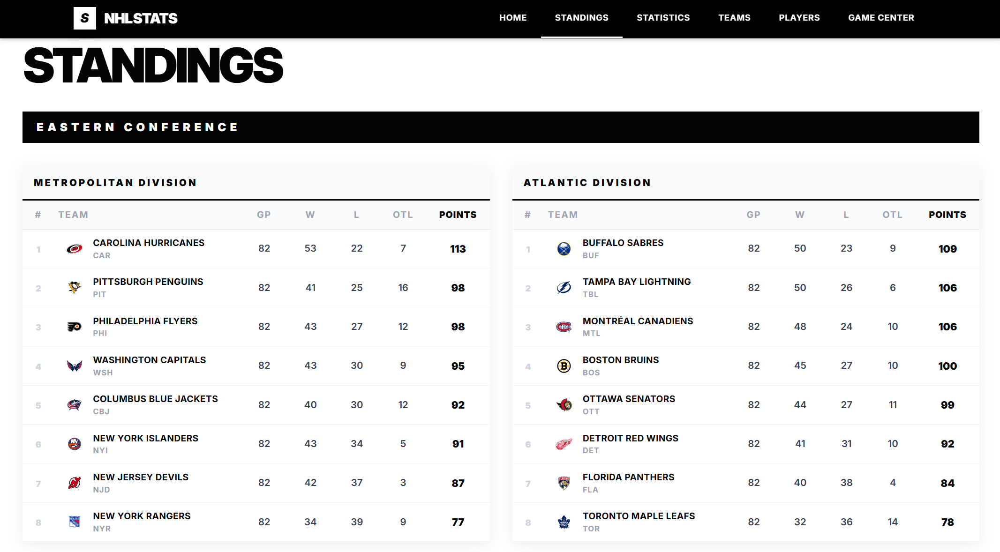
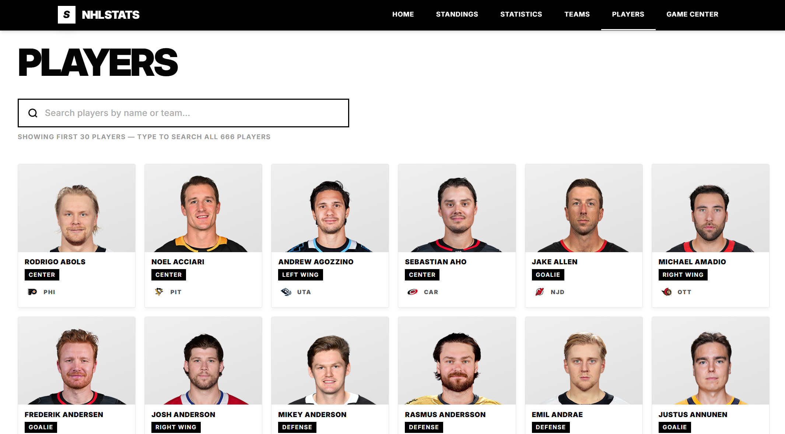
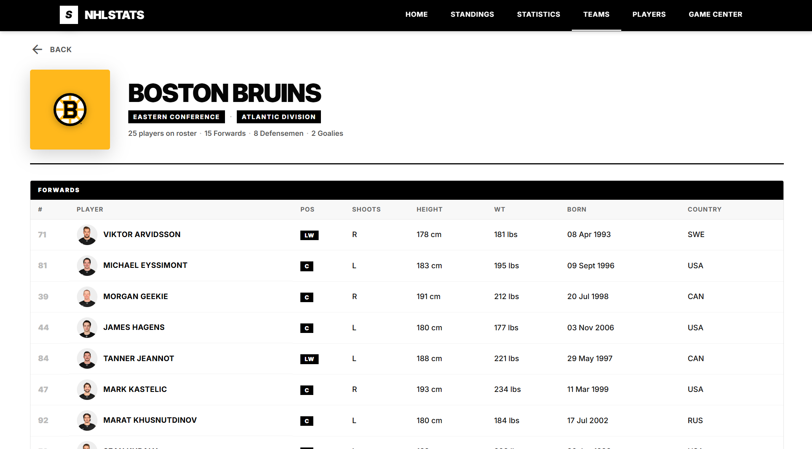

# NHL Stats Application

Website: https://nhl-stats-blush.vercel.app

## Overview
A full-stack web application designed to track and display real-time data from the National Hockey League (NHL). This project extracts and processes official NHL data to provide fans with a comprehensive view of the league's activity through a modern dashboard.

## Purpose
The application serves as a specialized interface for browsing NHL statistics. It connects to official API endpoints to retrieve live information, ensuring that users have access to up-to-date scores, standings, and player details in a readable and organized format.

## Data Extracted
The platform extracts a wide range of information from the official NHL API, including:
- **Live Games:** Real-time tracking of scores, periods, and game-specific statistics as they happen.
- **League Standings:** Current rankings across the entire league, broken down by conference and division.
- **Team Information:** A complete directory of NHL teams, including rosters and franchise data.
- **Player Profiles:** Detailed data for active NHL players, featuring career statistics and biographical information.
- **Statistics:** Comprehensive performance metrics for both teams and individual players.

## Screenshots

  
   
  
  

## Technical Stack
- **Frontend:** Angular 19+ (Signals, RxJS, Standalone Components)
- **Backend:** Node.js with Express

## Project Structure
- `/client`: The Angular frontend application containing all UI components and views.
- `/server`: The Node.js/Express backend that acts as a gateway to the official NHL API.

